# mlopspl 🛠️🔄🚀
mlopspl : E2E MLOps Vertex AI Pipelines # ML workflow # Kubeflow Pipelines SDK # Cloud Scheduler

## Objective

- Use the Kubeflow Pipelines SDK to build scalable ML pipelines
- Create & run a 3-step intro pipeline that takes text input
    - Create & run emoji pipeline
- Create & run pipeline that trains, evaluates & deploys an AutoML classification model
    - Build, run & get metadata for an end-to-end ML pipeline on Vertex AI Pipelines
- Use pre-built components for interacting with Vertex AI services, provided through the google_cloud_pipeline_components library
- Schedule pipeline job with Cloud Scheduler

## End-to-End MLOPS Vertex AI Pipelines

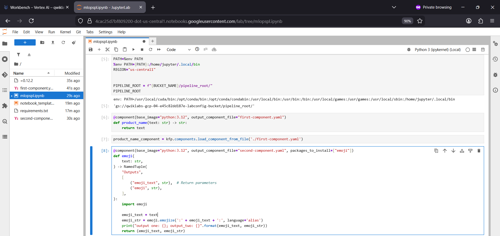

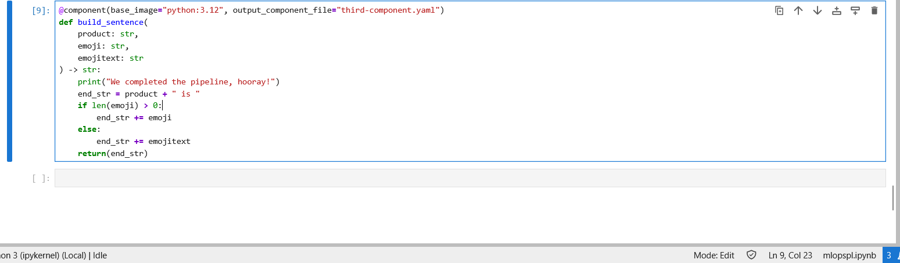

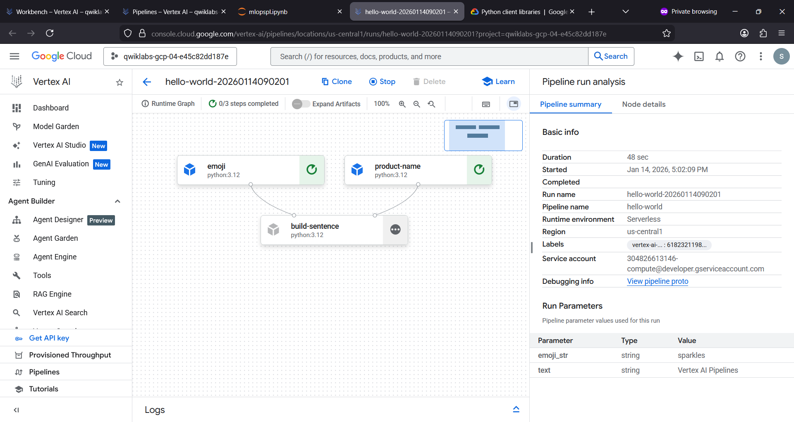

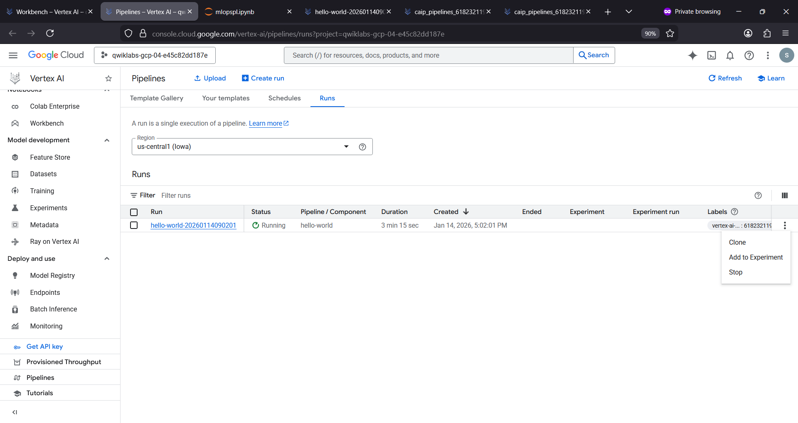

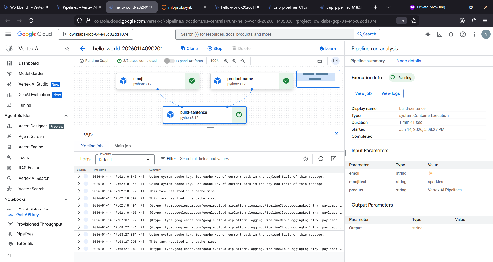

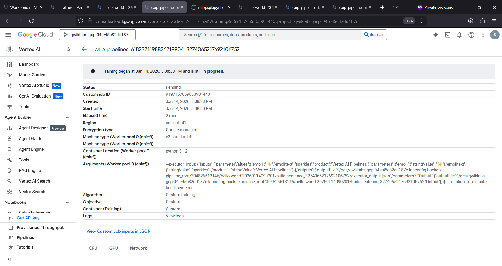

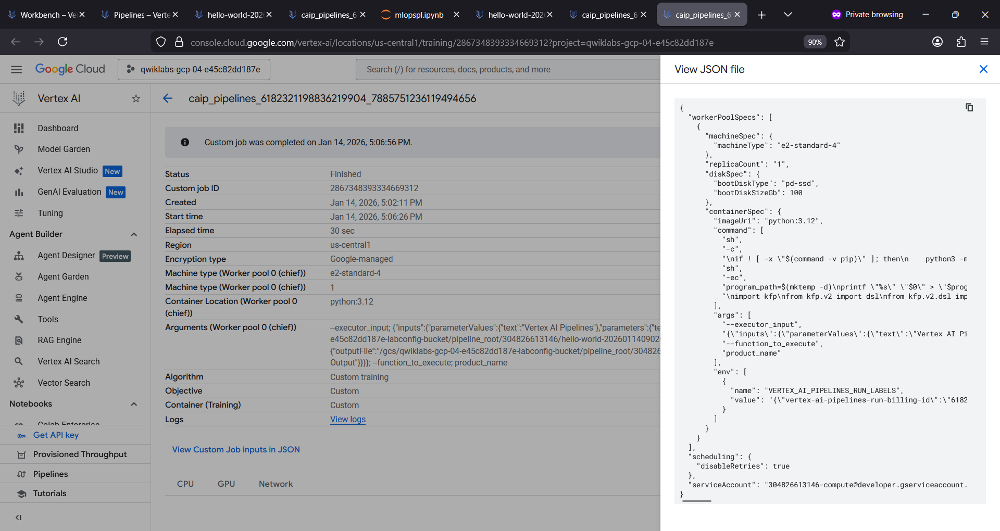

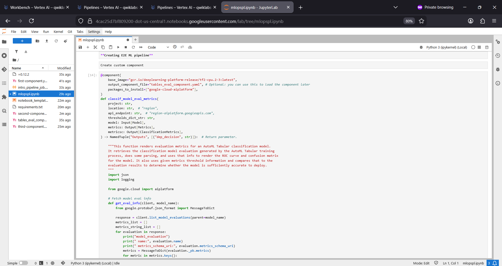

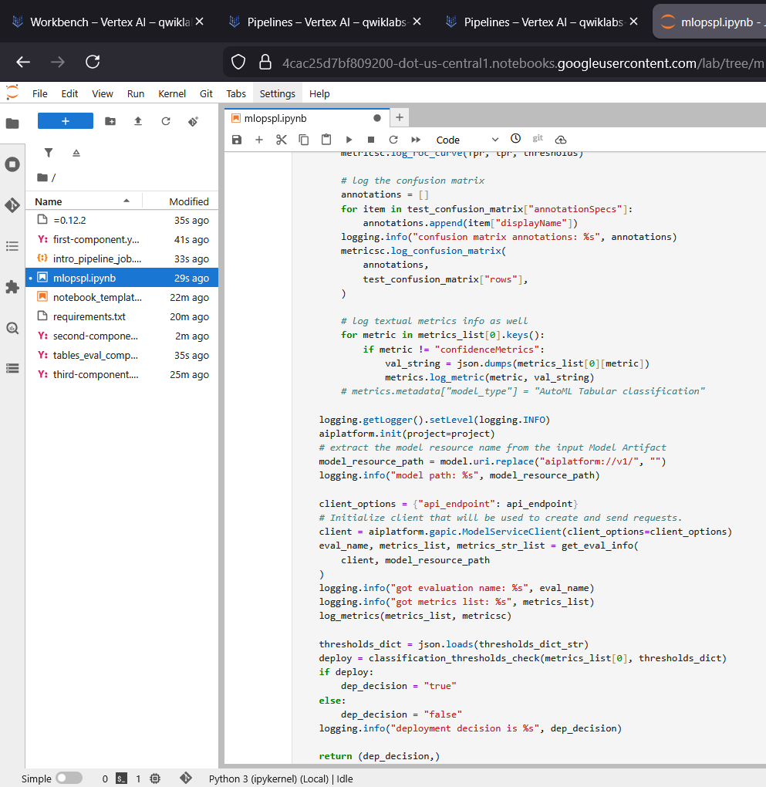

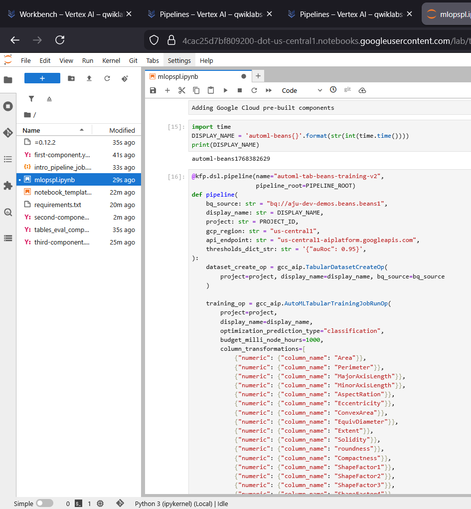

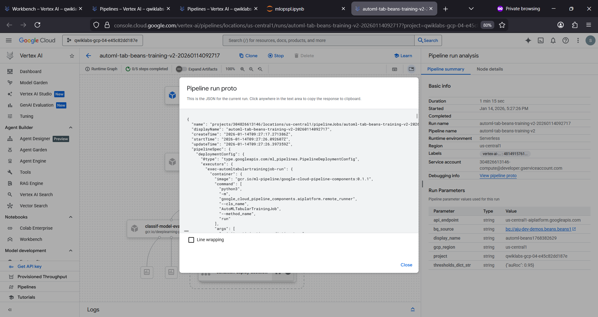

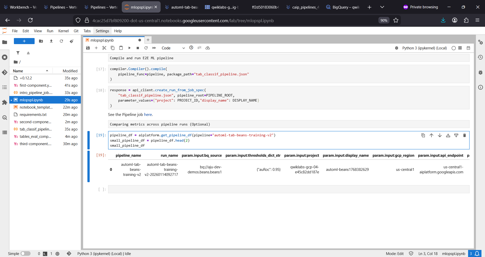

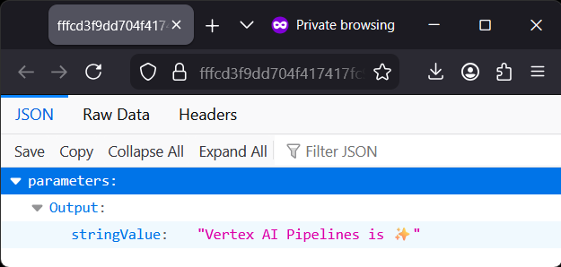

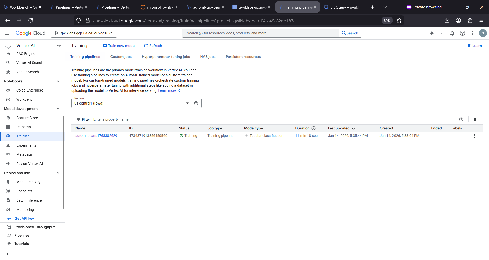

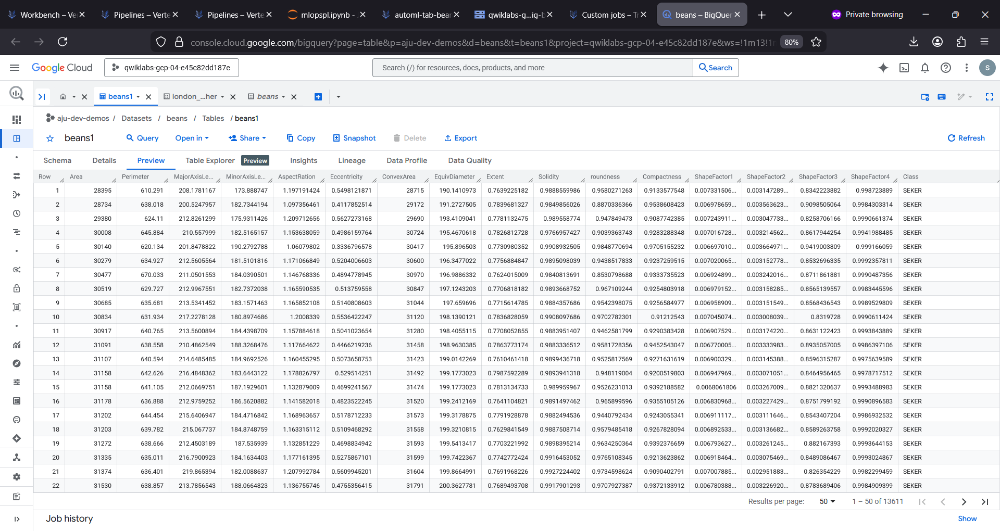

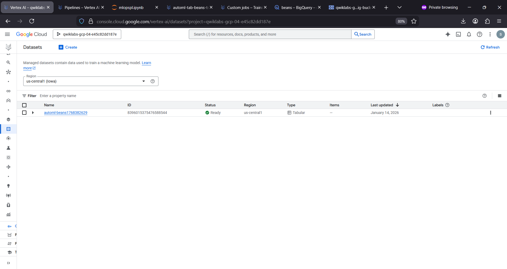

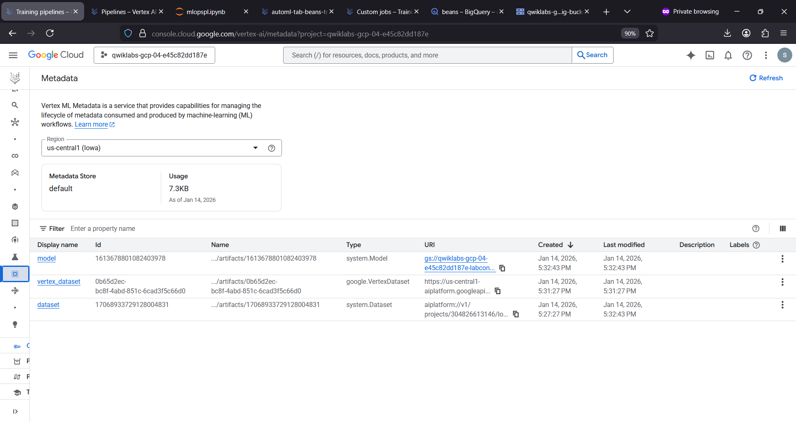

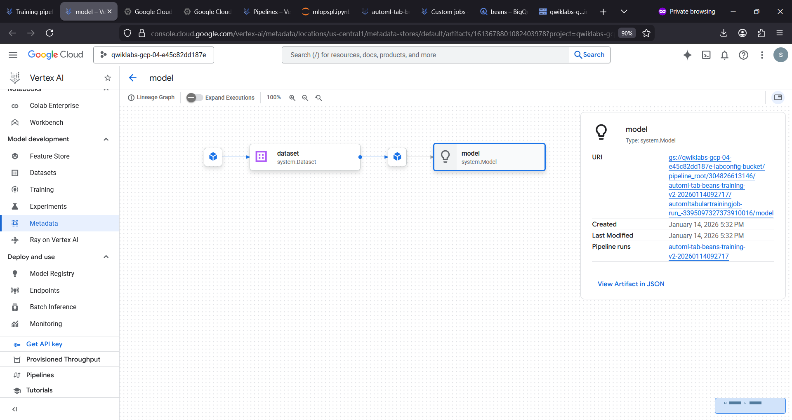

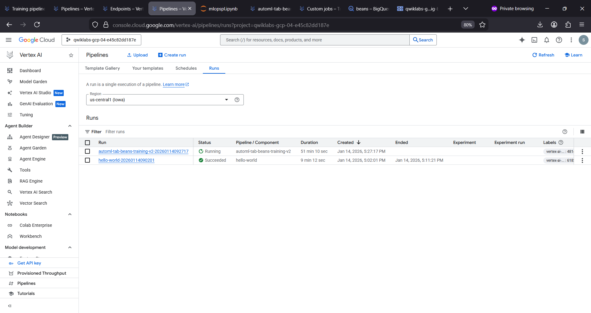

